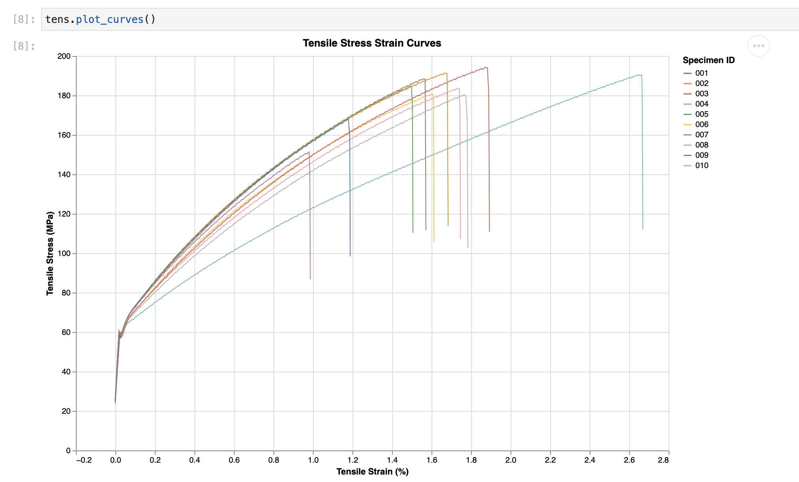

# pymechtest

[](https://github.com/FollowTheProcess/pymechtest)
[](https://pypi.python.org/pypi/pymechtest)

[](https://github.com/FollowTheProcess/pymechtest/actions?query=workflow%3ACI)

*pymechtest is a small, hopefully helpful python package to help engineers collate, process, analyse, and report on mechanical test data. I built pymechtest to help automate the things I did on a near-daily basis as a materials engineer. I hope it can prove some use to you too!*

* **Source Code**: [https://github.com/FollowTheProcess/pymechtest](https://github.com/FollowTheProcess/pymechtest)

* **Documentation**: [https://FollowTheProcess.github.io/pymechtest/](https://FollowTheProcess.github.io/pymechtest/)

## What is it?

*:warning: This project should be considered in alpha and may change significantly without deprecation cycles.*

Have you ever had to process a bunch of csv output from a mechanical test machine, copying and pasting data into a hacky Excel template to calculate things like elastic modulus and yield strength?

Only to then have to make another Excel file where you create a summary table...

And then have to copy and paste that into a report or an email...

And then you have to plot the data in Excel and spend half an hour tweaking the colours to get it to look at least halfway professional...

And then you discover Excel has formatted your strain column as a date for literally no reason so now your plots have broken...

And then next week you have to do all this again! :angry:

**No more!** :boom:

pymechtest has a very simple goal: to reduce the amount of time engineers spend munging data after a batch of mechanical testing.

Here is a quick taste of how easy it is to go from raw data to a gorgeous stress-strain plot:

```python
from pymechtest import Tensile

# header and id_row are related to the structure of your csv files
tens = Tensile(folder = "path/to/raw/data", header = 8, id_row = 3)

# Plot a really nice stress-strain curve with Altair
tens.plot_curves()
```



The key features are:

* **Intuitive**: The API is very intuitive, with descriptive methods like `plot_curves` and `summarise`
* **Column Autodetection**: pymechtest will try to auto-detect which columns correspond to stress and strain, and ask you to clarify if it can't.
* **Sensible Defaults**: The API is designed around sensible defaults for things like modulus strain range, whether to expect a yield strength etc.
* **Automatic Calculations**: pymechtest will automatically calculate strength, elastic modulus, yield strength etc. for you.
* **Elegant Looking Stress Strain Curves**: pymechtest uses [altair] to plot amazing looking stress strain curves.
* **Reliable**: pymechtest uses battle-tested libraries like [pandas], [numpy] and [altair] to do most of the work. The API is really a domain-specific convenience wrapper. pymechtest also maintains high test coverage.

## Installation

```shell
pip install pymechtest
```

I also plan to make a conda package for this, once I've learned how to do it!

## Help

**An important note about pymechtest**

While I've tried to generalise the API to be of use on different formats of raw data, it is impossible to cover every type of format and ensure compatability.

One way you can help is by try it on your data format, and raise an [issue] or submit a [PR] implementing your new format!

[altair]: https://altair-viz.github.io
[pandas]: https://pandas.pydata.org
[numpy]: https://numpy.org
[issue]: https://github.com/FollowTheProcess/pymechtest/issues
[PR]: https://github.com/FollowTheProcess/pymechtest/pulls
