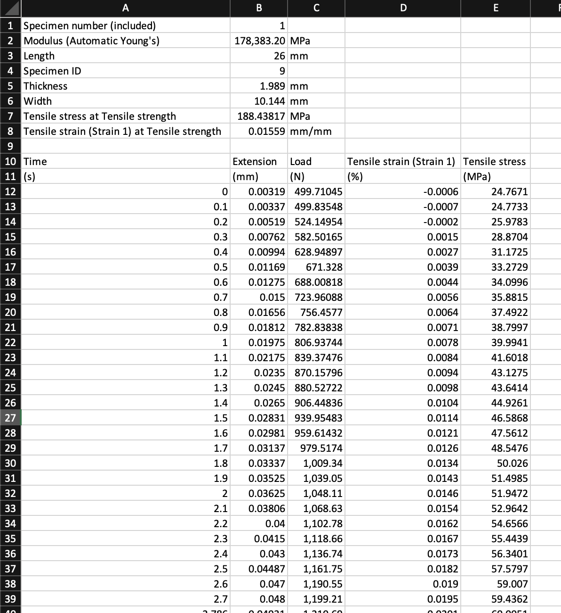
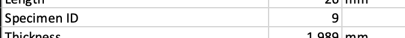
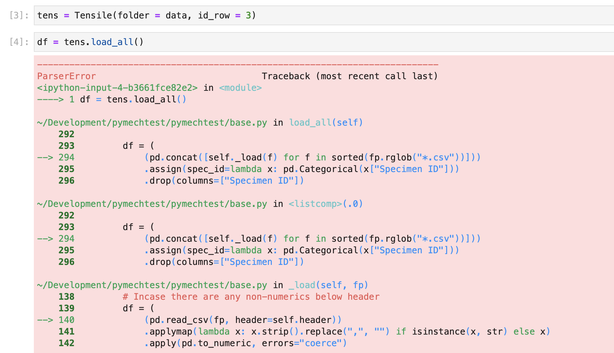
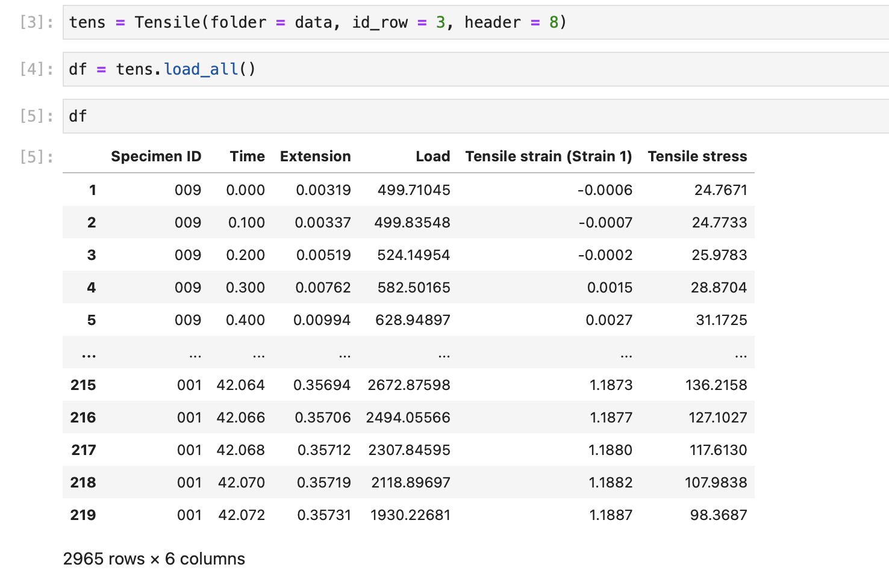
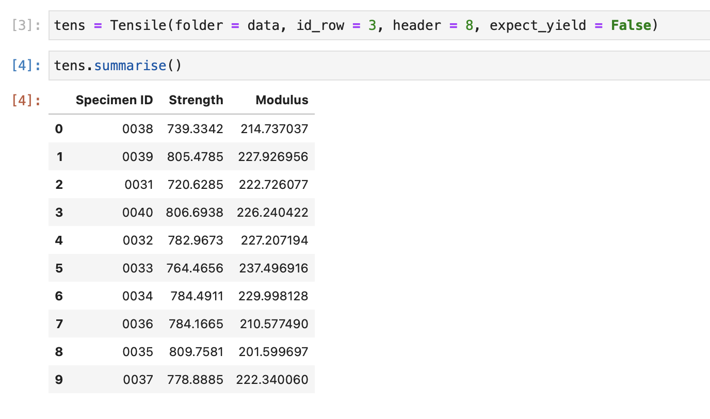

# Options & Arguments

All the static test classes in pymechtest have the same options and arguments available to them. These help you tweak what it does and doesn't load, what format the columns are in, whether you have specimen ID numbers in the files etc.

Here we'll explain how to use these with an example.

## Example

Let's use the `Tensile` class for a simple batch of tensile tests.

!!! note

    Don't forget, pymechtest also has `Compression`, `Shear` and `Flexure` classes we could easily have used, they all work exactly the same way!

pymechtest is designed to work directly from the raw data exported by the machine, so all you have to do is 'point it' at the folder where your batch of test data is and it will do the rest.

In order for it work properly though, with some formats of data you might have to configure a few things.

### ID Row

Let's say you've just finished doing a batch of tensile tests and have a folder of randomly named csv files corresponding to this batch.

Your csv file will look something like this (when opened in Excel):



There may or may not be some metadata at the top of the file, and then there'll be your data below.

In this example you notice we have a row called `Specimen ID` with the number 9, uniquely identifying this particular specimen in the batch.



Well pymechtest can use this! All you have to do is specify which row this ID is on with the `id_row` argument...

In our example, it's on the 4th row (so 3rd row in 0-indexed python)

```python
from pymechtest import Tensile

tens = Tensile(folder = "path/to/raw/data", id_row = 3)
```

Just by specifying this, you get this ID integrated into the rest of your work for free. For example, now the `.summarise` method will show it...


If your csv structure doesn't have this format, don't worry. If you don't enter anything for `id_row` the `Specimen ID` column in the `.summarise` result will use the file name instead.

### Header

Notice again in our example file, there's a load of metadata on top (which is where we got the Specimen ID from) containing things like specimen width, thickness etc. and the actual data doesn't start until later on down the file.

If you just try and read this in as it is, you'll get an error...



This error actually comes from [pandas] not from pymechtest, and it's because pandas tries to infer the structure of a csv from the first few rows. In our example case, the first few rows are different to the actual data. The actual data begins after row 9 (so 8 in 0-indexed python)

To fix this, you need to pass the `header` argument, telling pymechtest which row the **table header row is** i.e. the row containing your column titles like `Tensile stress` etc. In our case, this means `header = 8`

```python
from pymechtest import Tensile

tens = Tensile("path/to/raw/data", id_row = 3, header = 8)
```

And now it works perfectly!



!!! note

    In our example, the csv file had the units in brackets below the table headers. If this is true for your data too, or infact if your data has any non-numerics below your table headers, don't worry! pymechtest (well actually [pandas]) is smart enough to remove these for you.

!!! info

    Currently pymechtest doesn't support unit conversion. It assumes SI units: Stress = MPa, Modulus = GPa, Strain = %. This is something I want to support in the future and is on the roadmap.

### Strain1 & Strain2

Notice that the `.summarise` method calculates the elastic modulus. But you didn't tell it to do that, and you didn't specify how to calculate it or what strain range to use etc.

This is because pymechtest uses **sensible defaults** and actually configured this behind the scenes without you knowing. The range over which the elastic modulus is calculated is controlled by the `strain1` and `strain2` arguments and defaults to `0.05` and `0.15` (in % strain). This is a good range for a lot of common materials.

You can always override this by explicitly defining what you want `strain1` and `strain2` to be...

```python
from pymechtest import Tensile

tens = Tensile("path/to/raw/data", id_row = 3, header = 8, strain1 = 0.001, strain2 = 0.1)
```

Now pymechtest will use your values of `strain1` and `strain2` to calculate the modulus.

$$
E=\Delta\sigma / \Delta\epsilon
$$

With your ranges:

$$
E=\Delta\sigma / (strain2 - strain1)
$$

Obviously, if you define your own ranges, it's now up to you that those ranges are valid and you are still capturing the elastic portion of the stress strain curve, so you might want to check it out with `.plot_curves()` first!

!!! info
    
    Currently, only Young's modulus is supported. In the future I want to provide the option for different types of modulus i.e. secant, chord etc. This is on the roadmap!

### Expect Yield

You've seen how the `.summarise` method returns a column for yield strength in our earlier example. How did it know how to do that?

Well there's an argument for that: `expect_yield` which defaults to `True` (a sensible default).

!!! info

    By the way, pymechtest uses the 0.2% offset yield strength. Currently this is the only option, but in the future I want to support alternative methods such a slope threshold etc.

If you were testing a load of carbon fibre test pieces in the fibre direction, they are elastic to failure and the concept of yield strength becomes irrelevant.

In that case, you would pass `expect_yield = False` when instantiating the `Tensile` class...

```python
from pymechtest import Tensile

tens = Tensile(folder = "path/to/raw/data", id_row = 3, header = 8, expect_yield = False)
```

Now if you call `.summarise` on your non-yielding data, you won't see the yield strength column because it won't be calculated...



By tweaking all these things, it's my aim that pymechtest can be used to help you process lots of different types of mechanical test data output!

[pandas]: https://pandas.pydata.org
