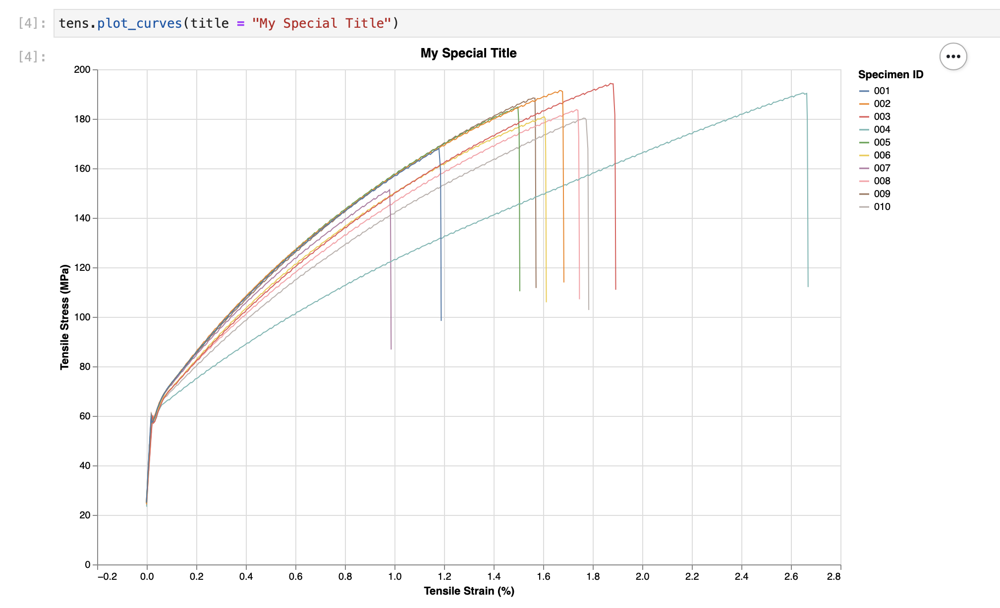

# Plot Curves

Probably the most important thing to do when analysing mechanical test data is to plot stress-strain curves for the batch so you can compare.

pymechtest uses [altair] which makes it super easy to plot really nice looking stress-strain curves by default.

The pymechtest plot style is very opinionated, the plots will come out looking the same every time and the API exposes very little in the way of customisation. If you want full control over how you want the plots to look, you might want to just do it manually by loading the data in with `.load_all()` and then using whatever plotting tool you like.

[altair]: https://altair-viz.github.io

Every static test method currently supported in pymechtest has a `.plot_curves()` method. Lets take a look at it...

## `plot_curves`

::: pymechtest.base.BaseMechanicalTest.plot_curves

## Making your plot

In 90% of the cases, you will probably just need to call `plot_curves()` with no arguments. Again, following the principle of **sensible defaults**, pymechtest will fill out a lot of the information for you.

For instance, if you're calling `plot_curves()` from an instance of the `Tensile` class, the title will be "Tensile Stress Strain Curves" and the axes titles will be "Tensile Stress" and "Tensile Strain".

Like so...


## Adjusting your plot

If you do want to specify things like the size of the plot, the title, the axis labels etc. pymechtest allows you to do that!

### Set the Title

If you don't want the default title of `{class_name} Stress Strain Curves` you can set your own using the `title` argument:

```python
from pymechtest import Tensile

tens = Tensile(folder = "path/to/raw/data", id_row = 3, header = 8)

tens.plot_curves(title = "My Special Title")
```



### Set the Axis Labels

Similarly, you can set the axis labels if you like:

```python
from pymechtest import Tensile

tens = Tensile(folder = "path/to/raw/data", id_row = 3, header = 8)

tens.plot_curves(title = "My Special Title", x_label = "Super Secret x Axis", y_label = "Super Secret y Axis")
```


## Saving your plot

Now making all these nice graphs wouldn't be much good if you couldn't save them to use later!

Luckily, you can do that too! By default, pymechtest won't save anything it will just show you the plot (if you're in a jupyter notebook). If you want it to save your plot somewhere, you need to pass it a path:

```python
from pymechtest import Tensile

tens = Tensile(folder = "path/to/raw/data", id_row = 3, header = 8)

tens.plot_curves(save_path = "path/to/graph.png")
```

You must pass a valid file extension for this bit, which is one of:

* `.png`
* `.svg`

Then pymechtest will then save your graph to the path you specify.

### Note about saving

I've mentioned before that pymechtest uses [altair] to generate the graphs. The way altair works is it turns your data into a vega or vega-lite schema (similar to JSON), this is then interpreted by the inner workings of altair and then rendered in your jupyter notebook (or supporting IDE) by javascript running in the browser (or the IDE).

To turn the graph into a static image (`.png` or `.svg`) altair converts the javascript rendering into an image file.

In order to do this, it needs to pipe the schema through a headless browser (or use nodejs). Which means you need to have installed one of the following options:

1) Google Chrome and the latest version of [chromedriver]

2) Firefox and the latest version of [geckodriver]

3) [nodejs]

The first two options are super easy to install and once you've done it once that's it you don't need to worry about it again! Let's face it, you probably already have either firefox or chrome anyway!

Installing nodejs is probably easy too, I've personally only ever done this with [homebrew] on a mac or with [conda] inside a conda environment:

```shell
# with homebrew
brew install node

# with conda
conda install -c conda-forge nodejs
```

pymechtest's default is to use the selenium and browser option, so if you save your graph as in the example above (without passing anything to the `save_method` argument) this is the method that will be used.

If you have chromedriver and chrome it will use that, and if you have geckodriver and firefox it will use that.

If you want to use [nodejs], you need to pass `node` to the `save_method` argument, like so:

```python
tens.plot_curves(save_path = "path/to/graph.png", save_method = "node")
```

More info on this can be found in [altair saver].

[altair saver]: https://github.com/altair-viz/altair_saver/
[altair]: https://altair-viz.github.io
[chromedriver]: https://chromedriver.chromium.org/downloads
[geckodriver]: https://github.com/mozilla/geckodriver
[nodejs]: https://nodejs.org/en/
[homebrew]: https://brew.sh
[conda]: https://docs.conda.io/en/latest/
