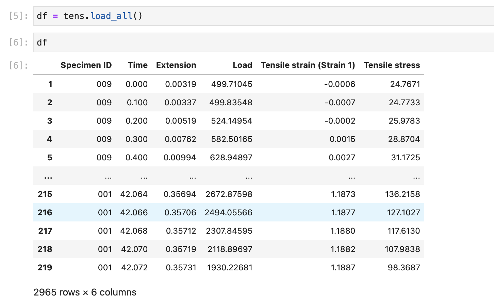
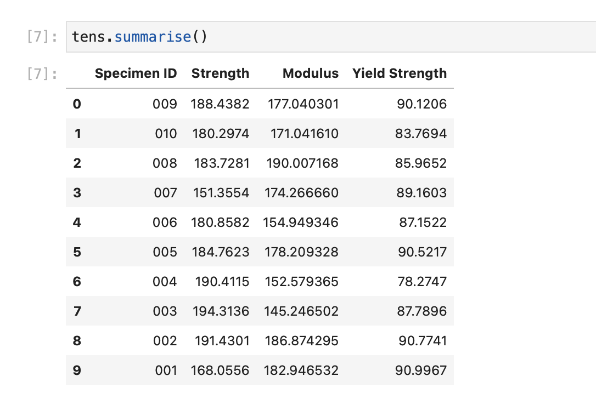

# Usage

pymechtest is a super tiny package, it focusses on just a few common tasks, as such it's super easy to learn!

## Installation

The very first thing you need to do is install `pymechtest`:

```shell
pip install pymechtest
```

This will install pymechtest and its core dependencies.

## Getting Data In

All you have to do to get data into pymechtest is instantiate the class specific to your test method (pymechtest currently supports `Tensile`, `Flexure`, and `Compression` static tests with some limited support for `Fatigue` (I'm working on it!))...

```python
from pymechtest import Tensile

tens = Tensile(folder = "path/to/raw/data")
```

This path can either be a simple string as in the example above, or you can pass it a `pathlib.Path` or infact any `osPathLike` object...

```python
from pymechtest import Tensile
from pathlib import Path

data = Path("path/to/raw/data").resolve()

tens = Tensile(folder = data)
```

Under the hood, pymechtest converts this to a pathlib.Path anyway so it can easily glob pattern match for csv files.

## Now What?

Now you have your data in, you can do a few things with it.

### Load to a Dataframe

If you know [pandas] and want to use its comprehensive functionality to manipulate your data, you can get your entire folder of data in a single dataframe...

```python
from pymechtest import Tensile

tens = Tensile(folder = "path/to/raw/data")

df = tens.load_all()
```

This will recursively search your folder for csv files and load them all into a dataframe for you to do whatever you want with!



### Summarise

If all you really want to see are the key values like elastic modulus, tensile strength etc for each specimen in your sample, use the `.summarise()` method...

```python
from pymechtest import Tensile

tens = Tensile("path/to/raw/data")

tens.summarise()
```

This will extract key values such as elastic modulus, tensile strength, yield strength (if `expect_yield = True` we'll talk about this later.) for each specimen in your sample.



### Stress-Strain Curves

Making nice looking stress strain curves has always been the bane of my life. With pymechtest, a gorgeous graph is only a method away..

```python
from pymechtest import Tensile

tens = Tensile("path/to/raw/data")

tens.plot_curves()
```

If you're working in a jupyter notebook or an IDE that supports them you will see the plot appear. You can also save the generated plot but we'll talk about that later too.


[pandas]: https://pandas.pydata.org
